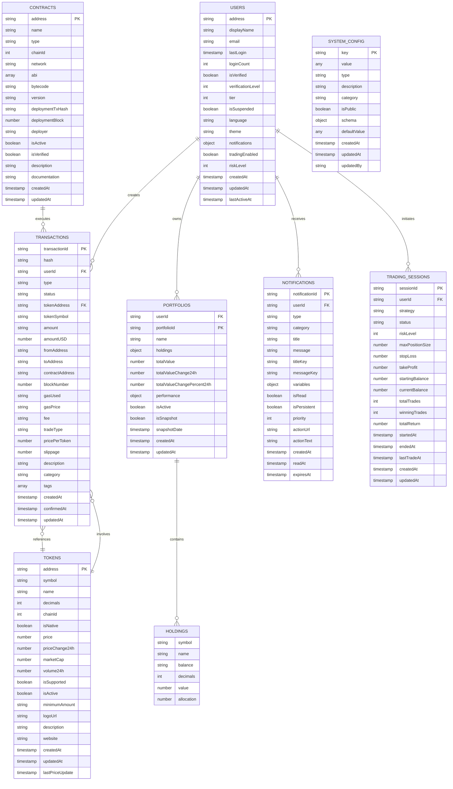
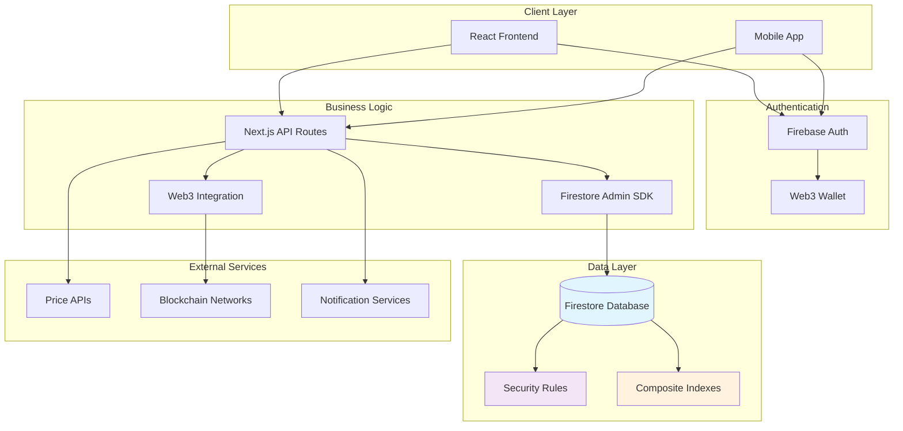
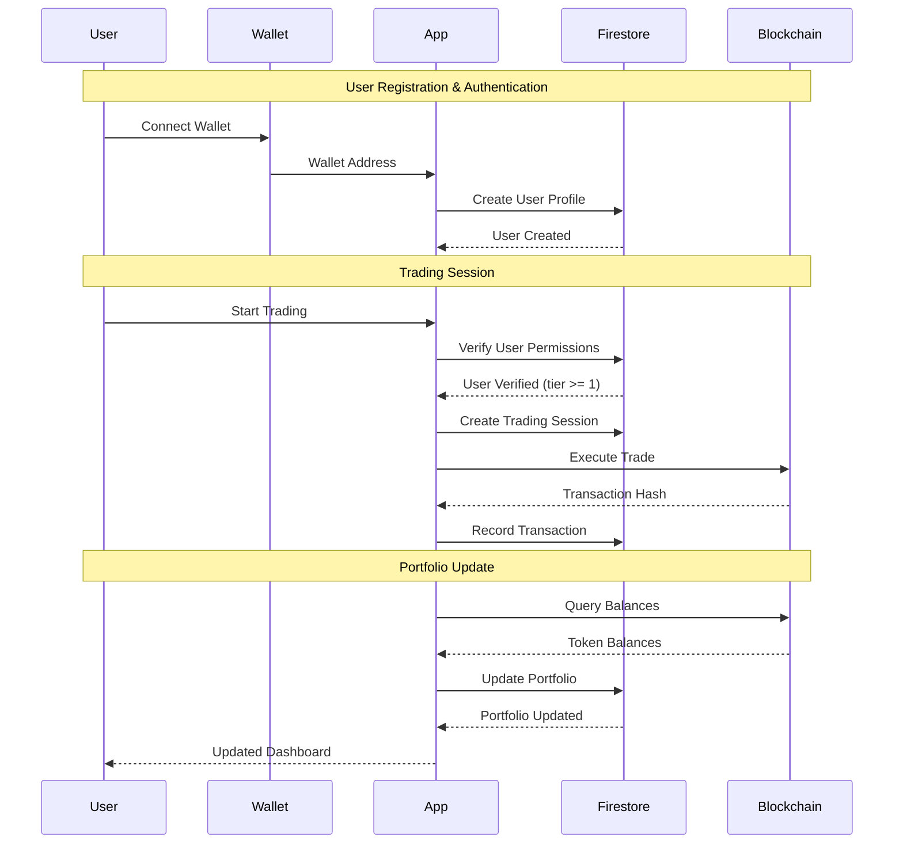

# QuantAI Firestore Data Model

This document describes the complete Firestore database schema for the QuantAI platform.

## Overview

The QuantAI platform uses Firestore as its primary database to support:
- User authentication and profiles
- Portfolio management
- Trading operations
- Transaction tracking
- Multi-language content
- Smart contract interactions
- Admin operations

## Collections Structure

### 1. Users Collection: `users`

**Document ID**: User's wallet address (lowercase)

```typescript
{
  // Identity
  address: string;              // Ethereum wallet address (lowercase)
  displayName?: string;         // Optional display name
  email?: string;              // Optional email
  avatar?: string;             // Profile image URL

  // Authentication
  sessionId?: string;          // Current session ID
  lastLogin: Timestamp;        // Last login time
  loginCount: number;          // Total login count

  // Verification & Access
  isVerified: boolean;         // KYC verification status
  verificationLevel: number;   // 0=none, 1=basic, 2=full
  tier: number;               // User tier (0=basic, 1=premium, 2=pro, 3=admin)
  isSuspended: boolean;       // Account suspension status
  suspensionReason?: string;  // Reason for suspension

  // Preferences
  language: string;           // Preferred language code
  theme: string;             // UI theme preference
  notifications: {
    email: boolean;
    push: boolean;
    trading: boolean;
    security: boolean;
  };

  // Trading
  tradingEnabled: boolean;    // Trading permission
  riskLevel: number;         // Risk tolerance (1-10)

  // Metadata
  createdAt: Timestamp;
  updatedAt: Timestamp;
  lastActiveAt: Timestamp;
}
```

**Subcollections**:
- `sessions`: User sessions
- `transactions`: User transaction history
- `portfolios`: User portfolio snapshots
- `notifications`: User notifications

### 2. Portfolios Collection: `portfolios`

**Document ID**: `{userId}_{timestamp}` for snapshots or `{userId}_current` for live data

```typescript
{
  // Identity
  userId: string;             // Reference to users collection
  portfolioId: string;        // Unique portfolio identifier
  name: string;              // Portfolio name

  // Holdings
  holdings: {
    [tokenAddress: string]: {
      symbol: string;         // Token symbol (ETH, USDC, etc.)
      name: string;          // Token full name
      balance: string;       // Token balance (as string for precision)
      decimals: number;      // Token decimals
      value: number;         // USD value
      allocation: number;    // Percentage of total portfolio
    };
  };

  // Performance
  totalValue: number;        // Total portfolio value in USD
  totalValueChange24h: number; // 24h change in USD
  totalValueChangePercent24h: number; // 24h change percentage

  // Statistics
  performance: {
    daily: number;           // Daily return percentage
    weekly: number;          // Weekly return percentage
    monthly: number;         // Monthly return percentage
    allTime: number;         // All-time return percentage
    sharpeRatio?: number;    // Risk-adjusted return
    maxDrawdown?: number;    // Maximum drawdown
  };

  // Metadata
  isActive: boolean;         // Current active portfolio
  isSnapshot: boolean;       // Historical snapshot flag
  snapshotDate?: Timestamp;  // When snapshot was taken
  createdAt: Timestamp;
  updatedAt: Timestamp;
}
```

### 3. Transactions Collection: `transactions`

**Document ID**: Transaction hash or auto-generated ID

```typescript
{
  // Identity
  transactionId: string;      // Unique transaction identifier
  hash?: string;             // Blockchain transaction hash
  userId: string;            // User who initiated transaction

  // Transaction Details
  type: string;              // deposit, withdraw, transfer, trade, reward
  status: string;            // pending, confirmed, failed, cancelled

  // Amounts
  tokenAddress: string;      // Token contract address (0x0 for ETH)
  tokenSymbol: string;       // Token symbol
  amount: string;           // Amount as string for precision
  amountUSD: number;        // USD value at time of transaction

  // Addresses
  fromAddress?: string;      // Source address
  toAddress?: string;       // Destination address
  contractAddress?: string; // Smart contract address

  // Blockchain Data
  blockNumber?: number;      // Block number
  gasUsed?: string;         // Gas used
  gasPrice?: string;        // Gas price
  fee?: string;             // Transaction fee

  // Trading Specific
  tradeType?: string;       // buy, sell, swap
  pricePerToken?: number;   // Price per token in USD
  slippage?: number;        // Slippage percentage

  // Metadata
  description: string;       // Human-readable description
  category: string;         // Category for filtering
  tags: string[];           // Tags for organization

  // Timestamps
  createdAt: Timestamp;
  confirmedAt?: Timestamp;
  updatedAt: Timestamp;
}
```

### 4. Tokens Collection: `tokens`

**Document ID**: Token contract address (lowercase)

```typescript
{
  // Identity
  address: string;           // Contract address (lowercase)
  symbol: string;           // Token symbol (ETH, USDC, etc.)
  name: string;             // Full token name

  // Contract Details
  decimals: number;         // Token decimals
  chainId: number;          // Blockchain network ID
  isNative: boolean;        // Is native token (ETH)

  // Market Data
  price: number;            // Current USD price
  priceChange24h: number;   // 24h price change
  marketCap?: number;       // Market capitalization
  volume24h?: number;       // 24h trading volume

  // Platform Integration
  isSupported: boolean;     // Supported by platform
  isActive: boolean;        // Active for trading
  minimumAmount: string;    // Minimum transaction amount

  // Metadata
  logoUrl?: string;         // Token logo image URL
  description?: string;     // Token description
  website?: string;         // Official website

  // Timestamps
  createdAt: Timestamp;
  updatedAt: Timestamp;
  lastPriceUpdate: Timestamp;
}
```

### 5. Smart Contracts Collection: `contracts`

**Document ID**: Contract address (lowercase)

```typescript
{
  // Identity
  address: string;          // Contract address (lowercase)
  name: string;            // Contract name
  type: string;            // portfolio, token, registry, etc.

  // Network
  chainId: number;         // Blockchain network
  network: string;         // Network name (mainnet, sepolia)

  // Contract Info
  abi: any[];             // Contract ABI
  bytecode?: string;      // Contract bytecode
  version: string;        // Contract version

  // Deployment
  deploymentTxHash?: string; // Deployment transaction hash
  deploymentBlock?: number;  // Deployment block number
  deployer: string;          // Deployer address

  // Status
  isActive: boolean;      // Contract is active
  isVerified: boolean;    // Contract is verified

  // Metadata
  description?: string;   // Contract description
  documentation?: string; // Documentation URL

  // Timestamps
  createdAt: Timestamp;
  updatedAt: Timestamp;
}
```

### 6. Trading Sessions Collection: `trading_sessions`

**Document ID**: Auto-generated

```typescript
{
  // Identity
  sessionId: string;       // Unique session identifier
  userId: string;         // User ID

  // Session Details
  strategy: string;       // Trading strategy name
  status: string;         // active, paused, stopped, completed

  // Configuration
  riskLevel: number;      // Risk level (1-10)
  maxPositionSize: number; // Maximum position size
  stopLoss: number;       // Stop loss percentage
  takeProfit: number;     // Take profit percentage

  // Performance
  startingBalance: number; // Starting balance in USD
  currentBalance: number;  // Current balance in USD
  totalTrades: number;     // Number of trades executed
  winningTrades: number;   // Number of winning trades
  totalReturn: number;     // Total return percentage

  // Timestamps
  startedAt: Timestamp;
  endedAt?: Timestamp;
  lastTradeAt?: Timestamp;
  createdAt: Timestamp;
  updatedAt: Timestamp;
}
```

### 7. Notifications Collection: `notifications`

**Document ID**: Auto-generated

```typescript
{
  // Identity
  notificationId: string;  // Unique notification ID
  userId: string;         // Target user ID

  // Content
  type: string;           // info, warning, error, success
  category: string;       // trading, security, system, portfolio
  title: string;          // Notification title
  message: string;        // Notification message

  // Localization
  titleKey?: string;      // Translation key for title
  messageKey?: string;    // Translation key for message
  variables?: object;     // Variables for translation

  // Status
  isRead: boolean;        // Read status
  isPersistent: boolean;  // Should persist after reading
  priority: number;       // Priority level (1-5)

  // Actions
  actionUrl?: string;     // URL to navigate to
  actionText?: string;    // Action button text

  // Timestamps
  createdAt: Timestamp;
  readAt?: Timestamp;
  expiresAt?: Timestamp;
}
```

### 8. System Configuration Collection: `system_config`

**Document ID**: Configuration key

```typescript
{
  // Identity
  key: string;            // Configuration key

  // Value
  value: any;             // Configuration value
  type: string;           // string, number, boolean, object, array

  // Metadata
  description: string;    // Configuration description
  category: string;       // Configuration category
  isPublic: boolean;      // Can be read by clients

  // Validation
  schema?: object;        // JSON schema for validation
  defaultValue?: any;     // Default value

  // Timestamps
  createdAt: Timestamp;
  updatedAt: Timestamp;
  updatedBy: string;      // User who updated
}
```

## Security Rules Structure

The Firestore security rules implement role-based access control:

- **Public Read**: Tokens, system configuration (public)
- **User Access**: Users can read/write their own data
- **Admin Access**: Admins can read/write all data
- **Service Access**: Backend services have full access

## Indexes

Composite indexes are required for:

1. **User Queries**:
   - `users` by `tier` and `isVerified`
   - `users` by `lastActiveAt` and `isVerified`

2. **Transaction Queries**:
   - `transactions` by `userId` and `createdAt`
   - `transactions` by `userId`, `type`, and `createdAt`
   - `transactions` by `status` and `createdAt`

3. **Portfolio Queries**:
   - `portfolios` by `userId` and `isActive`
   - `portfolios` by `userId` and `createdAt`

4. **Notification Queries**:
   - `notifications` by `userId` and `isRead`
   - `notifications` by `userId` and `createdAt`

## Data Relationships



## System Architecture Overview



## Data Flow Patterns



## Naming Conventions

- **Collections**: snake_case
- **Documents**: camelCase for fields, lowercase addresses for IDs
- **References**: Always use document IDs, not full references
- **Timestamps**: Always use Firestore Timestamp type
- **Amounts**: Store as strings to preserve precision

## Scalability Considerations

- **Avoid deep nesting**: Maximum 2 levels of subcollections
- **Batch operations**: Use batch writes for related updates
- **Pagination**: All list queries should support pagination
- **Indexes**: Only create indexes for actual query patterns
- **Data archiving**: Old data should be moved to separate collections